# HeritEdge — Interactive Experience Specification

A step-by-step description of what the user sees, hears, and can do at every point in the app. Written so all six teammates can read it, agree on it, and then split the implementation work.

> Read this before writing any new code. If something in here is wrong, fix it here first, then we update the JSON / components.

---


Files marked "*same template as*" reuse an earlier mockup since the JSX/style is identical — only the content differs. The team can copy the source and swap text + image.

---


## Product vision in one paragraph

A visitor in Piazza del Duomo opens the app and goes through **two acts**: first a **Tour Guide** that tells the linear story of three buildings across three coherent periods, then an **AR Experience** that turns the camera into a time-window onto moments that happened on the very spot they're standing. The **treasure hunt** is woven through both acts as contextual questions and photo challenges. At the end, the visitor takes a **souvenir selfie** with a fun period-themed face filter.

Everywhere: voice narration from **Luca** (warm, slightly theatrical), a global **play/stop pill**, a **theme toggle**, and a **one-tap chat** with Luca for going deeper.

---

## The three locked periods

These names appear identically in the Tour, in the AR, in the treasure hunt, in the chat, and in the souvenir caption. **No other period vocabulary is used anywhere in the app.**

| Period | Years | Headline | Palette tint |
|---|---|---|---|
| **Birth** | 1386 – 1500s | The cathedral begins. Visconti and Sforza shape Milan. | Warm parchment, soft gold |
| **Crown** | 1500s – 1860 | Renaissance, Habsburg, Napoleon. The Madonnina rises. Piermarini rebuilds Palazzo Reale. | Golden hour, deep amber |
| **Modern** | 1860 – today | Italy unifies. Galleria opens. Bombs fall. Fashion rises. | Clean cream + black |

Each landmark exists across these three periods:

- **Duomo** — Birth: foundation laid · Crown: Madonnina placed, façade finished · Modern: bronze doors completed, WWII near-miss, today's 6 M visitors/year.
- **Galleria** — Birth: medieval streets and Santa Tecla church on the site · Crown: site still cluttered, no arcade yet · Modern: built 1865–77, Mengoni dies, becomes Milan's "drawing room".
- **Palazzo Reale** — Birth: medieval Broletto, Visconti and Sforza court, Beatrice d'Este's salon, Leonardo's visits · Crown: 1598 fire, Piermarini rebuilds 1773–78, Napoleon's stepson lives here · Modern: 1943 bombing, Cariatidi left scarred, today's premier exhibition venue.

---

# ACT ONE · Tour Guide

A linear three-chapter journey, ~9 minutes total. Each chapter is a sequence of 6 scenes. The user can pause, rewind, branch into "Ask Luca", or stop and resume later.

## Entry — Home → Tour

1. User on Home screen, taps **"Start the tour"** (gold button).
2. Screen fades to dark. A 2-second loading title appears: "Birth · 1386 – 1500s · Chapter 1 of 3". Faint matins-bell ambient fades in.
3. The cinematic hero of Chapter 1 appears (see scene 0 below).

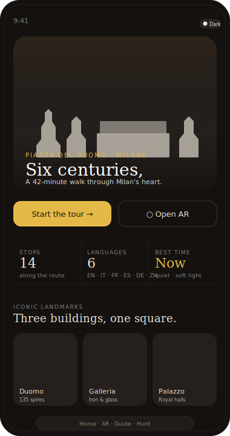

## Chapter 1 — Birth (1386 – 1500s)

### Scene 0 — Cinematic hero
- **Visual:** Cesare Cesariano's 1521 elevation drawing of the cathedral, desaturated, behind the gold dot grid that's already in the codebase.
- **Sub-title:** "Birth · 1386 – 1500s · Chapter 1 of 3"
- **Audio:** Distant church bell loop at low volume, no narration yet.
- **Action:** Tap **"Begin chapter →"**. Bell fades, Luca's voice fades in.

### Scene 1.1 — Pull quote *(15 s)*
- **Visual:** Centered serif italic on dark, gold quote-mark above.
- **Text:** *"A city dared to begin a cathedral that would outlive every hand that touched it."*
- **Audio:** Luca narrates the quote slowly. Single soft bell at the end.
- **Action:** Tap → next.

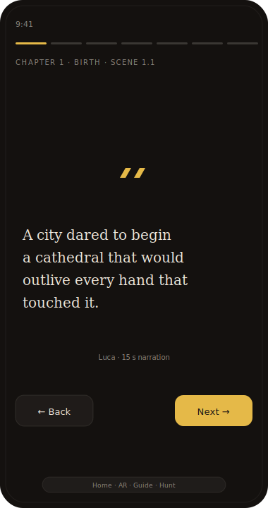

### Scene 1.2 — Narrative · The first stone *(25 s)*
- **Eyebrow:** 5 August 1386.
- **Heading:** *"The first stone."*
- **Body:** "Archbishop Antonio da Saluzzo lays the first stone. Duke Gian Galeazzo Visconti adopts the cathedral as a state enterprise — Milan will have a Gothic answer to Cologne and Reims."
- **Image (right side, ~120 px wide):** small thumbnail of a 14th-century engraving showing the cathedral apse rising.
- **Audio:** Luca narrates the body with comma pauses for breath.
- **Action:** Tap → next. *"Ask Luca more →"* chip available.

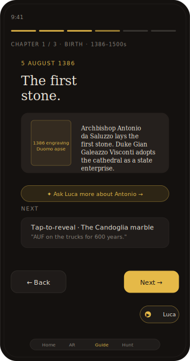

### Scene 1.3 — Tap-to-reveal · The Candoglia marble *(20 s)*
- **Question:** *"Where does the cathedral's marble come from?"*
- **Reveal (tap to flip):** "Candoglia, Piedmont — granted to the Fabbrica by Visconti in 1387, **in perpetuity**. Six centuries later, marble still travels down the Naviglio canals to the building site. The trucks are painted with **AUF** — *Ad Usum Fabricae*, 'for the use of the Fabbrica'. The abbreviation passed into Milanese slang: doing something *a ufo* means doing it for free."
- **Image inside reveal:** a modern photo of an AUF-marked marble truck.
- **Audio:** Luca speaks the reveal text.
- **Action:** Tap to reveal, then tap → next.

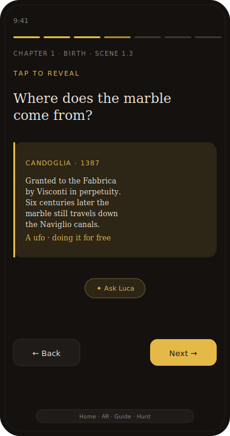

### Scene 1.4 — Mini-game · Year guess *(30 s)*
- **Question:** "How many years did the foundation excavations take?"
- **Options (3 buttons):** *2 years* · *7 years* · *14 years*
- **On answer:** correct = soft success chime + green tick. Wrong = no penalty, soft "hmm" + amber tick. Reveal text below: "**14 years** of digging before the first stone could rise above ground. A measure of how seriously the city took the project."
- **Audio:** Luca confirms the answer with warmth ("That's right — fourteen years…").
- **Action:** **Continue →** appears after answer.

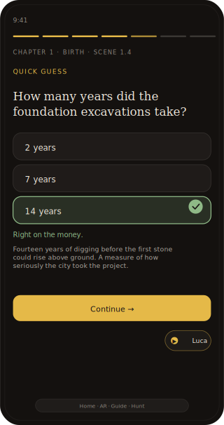

### Scene 1.5 — Before/After slider · The cluttered piazza *(20 s)*
- **Before:** Bellotto's 1744 view of the central piazza — medieval shops and small buildings still pressed against the cathedral's south side.
- **After:** Modern aerial photo of the cleared Piazza del Duomo.
- **Caption (below the slider):** *"The square only became a 'square' in the 1870s. Until then, the cathedral stood inside a city, not above it."*
- **Audio:** Faint piazza ambient (footsteps, distant chatter) when the after side is dominant. Medieval bells when the before side is dominant.
- **Action:** Drag the handle. *Auto-wipe-and-back* plays once on first reveal to teach the affordance. Then **Continue →**.

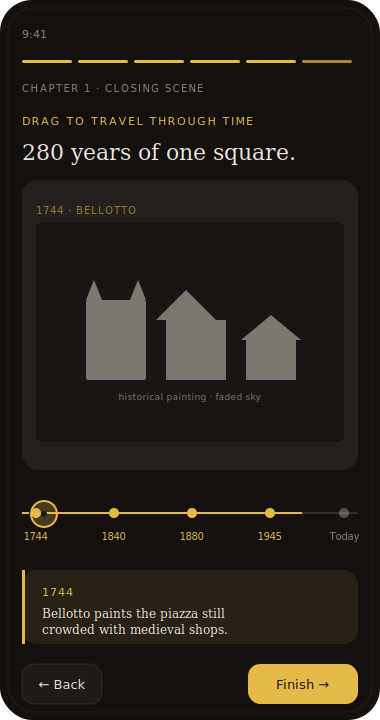

### Scene 1.6 — Closing · "But this was only the beginning."
- **Visual:** Dark fade with gold accent.
- **Heading:** *"But this was only the beginning."*
- **Body:** "The Visconti gave the cathedral marble. The Sforza would give it Leonardo. The Habsburg crowns and Napoleonic France were still centuries away."
- **Action:** Tap **"Begin Chapter 2 — Crown →"**. The screen transitions with a warmth shift to the next chapter.

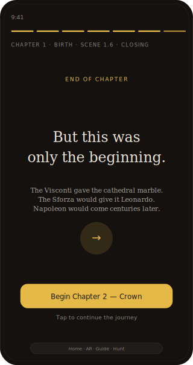

## Chapter 2 — Crown (1500s – 1860)

### Scene 0 — Cinematic hero
- **Visual:** Bellotto's 1744 view (warm tones, desaturated), gold dot grid.
- **Sub-title:** "Crown · 1500s – 1860 · Chapter 2 of 3"
- **Audio:** Soft baroque harpsichord chord (single, sustained).

### Scene 2.1 — Pull quote *(15 s)*
- **Text:** *"Leonardo sketched the dome's heart. The Gothic listened, and answered in marble."*

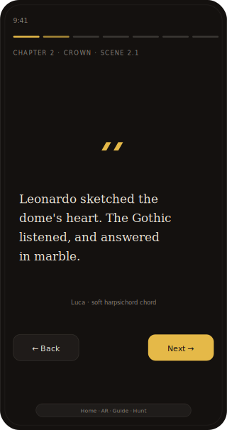

### Scene 2.2 — Tap-to-reveal · Did Leonardo really? *(25 s)*
- **Question:** "Did Leonardo da Vinci really work on the Duomo?"
- **Reveal:** "Yes. In 1487–88 he submitted designs and a wooden model for the **tiburio** — the central dome over the crossing. His sketches survive in the Codex Atlanticus, kept at the Biblioteca Ambrosiana right here in Milan."
- **Image inside reveal:** Codex Atlanticus folio 719r (Leonardo's actual sketch).

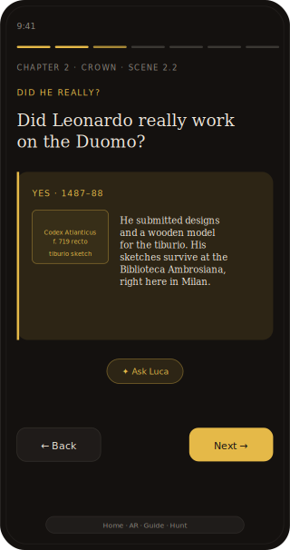

### Scene 2.3 — Mini-game · Match the architect *(45 s)*
- **Visual:** Three buildings on top (Duomo · Palazzo Reale · La Scala), three names on bottom (Simone da Orsenigo · Giuseppe Piermarini · ?). User drags lines.
- **Twist:** Piermarini designed **both** the Palazzo Reale and La Scala (and they share a wall). Galleria is a card with a "Not built yet — wait until Modern" tag.
- **On success:** Luca: "Piermarini designed both buildings. La Scala opens in 1778, the same year he finishes the Palazzo's grand hall. The two share a wall."
- **Action:** Continue →

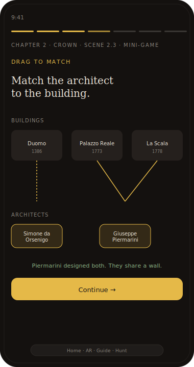

### Scene 2.4 — Narrative · The Madonnina rises *(30 s)*
- **Eyebrow:** 30 December 1774.
- **Heading:** *"Milan's golden guardian."*
- **Body:** "A 4.16 m gilded copper statue of the Virgin Mary is placed atop the central spire at **108.5 m** above the ground. Sculptor Giuseppe Perego, goldsmith Giuseppe Bini. An unwritten rule begins: **no Milanese building should rise above her.**"
- **Image:** Period engraving of the Madonnina being raised by ropes onto the spire.
- **Audio:** A single high bell. Luca narrates over it.

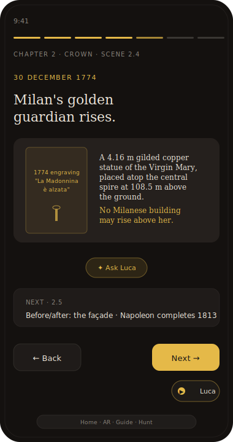

### Scene 2.5 — Before/After slider · The façade *(20 s)*
- **Before:** 1790s engraving of the Duomo with an unfinished brick façade.
- **After:** Today's completed marble face.
- **Caption:** *"Napoleon ordered the façade finished before his 1805 coronation as King of Italy. His name is carved on it."*


### Scene 2.6 — Closing
- **Heading:** *"Then the modern world arrived."*
- **Body:** "Italy unified. A glass arcade rose. And one summer night in 1943, the bombs of war wrote one more chapter."
- **Action:** **"Begin Chapter 3 — Modern →"**


## Chapter 3 — Modern (1860 – today)

### Scene 0 — Cinematic hero
- **Visual:** Achille Beltrame's 1877 *L'Illustrazione Italiana* cover of the Galleria inauguration, desaturated.
- **Sub-title:** "Modern · 1860 – today · Chapter 3 of 3"

### Scene 3.1 — Pull quote *(15 s)*
- **Text:** *"Italy found a stage. The Galleria opened. The square became a city's living room."*

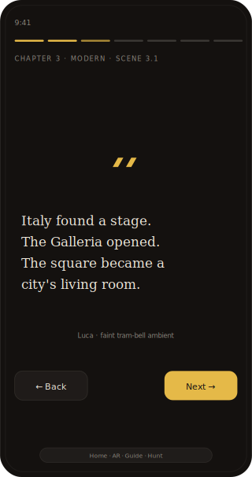

### Scene 3.2 — Narrative · Mengoni wins *(30 s)*
- **Eyebrow:** 7 March 1865.
- **Heading:** *"Mengoni wins."*
- **Body:** "King Vittorio Emanuele II lays the first stone of an iron-and-glass arcade between the Duomo and La Scala. Architect Giuseppe Mengoni, 1829–1877, wins a national competition with a design fusing Renaissance façades and British industrial iron."
- **Image:** 1870s construction photograph of the iron skeleton.


### Scene 3.3 — Tap-to-reveal · Did Mengoni see it open? *(30 s)*
- **Question:** "Did the architect see his arcade open?"
- **Reveal:** "Two days before the inauguration, on **30 December 1877**, Mengoni fell from the scaffolding of the triumphal arch facing the Duomo. He died on the spot. Whether it was an accident, a heart attack at altitude, or — as some whispered — a suicide brought on by financial pressure, has never been resolved. He was 47."
- **Image inside reveal:** Period print of the triumphal arch.
- **Audio:** A single low note, no music.

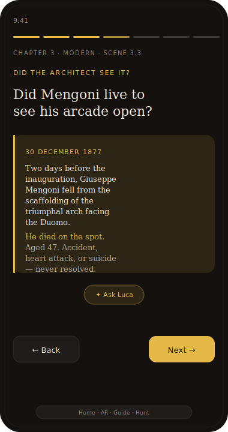

### Scene 3.4 — Embedded video · 25 April 1945 *(30 s clip)*
- **Title above the video:** "25 April 1945 · Milan liberated"
- **Video:** ~30 s public-domain archival clip of crowds in Piazza del Duomo on Liberation Day. *(If not available, fall back to a still photo loop with subtle Ken Burns pan.)*
- **Audio:** The video's original crowd ambient. Luca's voice does not speak over it.
- **Caption below:** *"Three years earlier the square was empty under air-raid sirens. Today, this is the first crowd to fill it freely."*
- **Action:** Auto-advances after the clip finishes, or tap to skip.

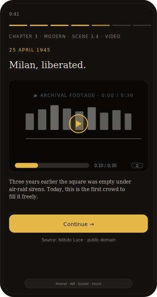

### Scene 3.5 — Before/After slider · Sala delle Cariatidi *(30 s)*
- **THIS IS THE EMOTIONAL CENTREPIECE OF THE WHOLE APP.**
- **Before:** Brogi 1900 photograph of the intact 18th-century hall.
- **After:** Modern photograph of the deliberately-scarred hall (caryatids cleaned but never re-finished).
- **Caption:** *"15 August 1943. Allied bombs ignited the wooden roof. The hall was never fully restored. In 1953, Picasso's *Guernica* was hung here, against the still-blackened walls. The painting about war, in a room destroyed by war."*
- **Audio:** Silence under the slider. A single faint sustained string note when the user starts dragging.

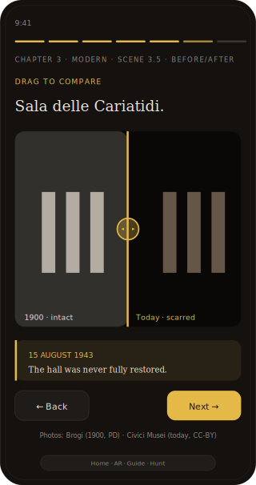

### Scene 3.6 — Closing · "Step outside"
- **Heading:** *"And here we are."*
- **Body:** "Six centuries condensed into one square. The Madonnina is still watching. Now look around — there's more history out there than fits in a chapter."
- **Action:** **"Continue to AR Experience →"** — this is the transition into Act Two.


## Throughout Act One

- **Play/pause pill** (bottom-right, gold) appears whenever Luca is speaking. Tap to pause. Auto-resets to stop on every route change.
- **"Ask Luca more →"** chip below every scene's body text. Tap → opens the chat view with a pre-filled question contextual to the scene ("Tell me more about the AUF marble"). Returning to the tour resumes at the same scene.
- **Segmented progress bar** at the top: 18 segments (6 per chapter), fills as user advances.
- **Theme toggle** (top-right).
- **Skip chapter →** option in a small menu, in case the user wants to jump.

---

# ACT TWO · AR Experience

A complementary experience that uses the phone camera to overlay **moments that happened in the square** — not buildings, but events. The user can switch periods and see different moments appear as gold dots over the live camera.

## Entry — End of Act One → AR

1. After Chapter 3 closing, transition card: *"Now look at the square itself."*
2. Camera permission prompt. If denied, fallback to a static panorama of the piazza with the same hotspots.
3. Once granted: live camera feed full-screen with a thin gold border, a small "Birth · Crown · Modern" period selector pill at the top, and a centering arrow at the bottom-centre.

## Period selector

A small pill at the top with three segments. Default selection = the period the user just finished in Act One (typically Birth on first entry).

- **Birth selected:** warm parchment-tinted overlay on the camera, faint medieval chant ambient, period-specific hotspots appear (see below).
- **Crown selected:** golden-hour warmth overlay, soft baroque harpsichord ambient.
- **Modern selected:** no overlay (clean camera), faint distant tram-bell ambient.

Switching periods animates the hotspots in/out with a 0.4 s fade.

## Centering arrow

A subtle floating chevron pill at the bottom-centre of the screen. When the user is facing a direction without nearby hotspots, the arrow gently points to the nearest one with a label: "↗ Toward 1774 · Madonnina". Tapping the arrow plays a 0.5 s pan animation or just shows "Look this way →" depending on device capability. Disappears once the user is facing a hotspot.

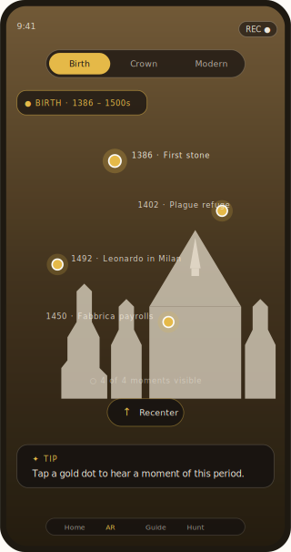

## Hotspots — moments in the square

Period-specific gold dots float over the camera, anchored to compass headings (not GPS-accurate, just relative to the device's orientation). Each hotspot is a **MOMENT in time**, not a building.

### Birth period hotspots *(facing the cathedral)*
- **1386 · First stone** *(over central façade)* — engraving + Luca: "Right here, eight centuries ago, an archbishop placed the cornerstone of a building that would outlive the city he knew." Has a 5 s audio of monastic chant under Luca's voice.
- **1402 · Plague refuge** *(over north flank)* — "When plague returned, the Visconti court took refuge inside these walls. The Duomo was a shelter as much as a church."
- **1492 · Leonardo in Milan** *(over Palazzo Reale)* — "Leonardo was Ludovico Sforza's court engineer for seventeen years. He walked from here to Santa Maria delle Grazie to paint *The Last Supper*."

### Crown period hotspots
- **1576 · Plague procession** *(over central piazza)* — "Cardinal Carlo Borromeo led a barefoot procession through this square at the height of the plague. He survived; the painting that commemorates him still hangs in the Duomo."
- **1774 · Madonnina rises** *(over central spire)* — 1774 engraving + Luca's full story + 10 s of bells.
- **1805 · Napoleon's coronation** *(over Palazzo Reale entrance)* — Andrea Appiani's painting + Luca: "Right here, Napoleon's carriage stopped on the morning of his coronation as King of Italy. Inside the Duomo, he placed the Iron Crown on his own head."
- **1830s · The salon era** *(over Palazzo Reale side wing)* — "The Salotto Maffei met two streets from here. Verdi, Manzoni, and Risorgimento conspirators planned a country there over tea."

### Modern period hotspots — the densest, the most emotional
- **1877 · Mengoni's fall** *(over Galleria's triumphal arch)* — Period photo + Luca's full story.
- **1898 · Bava-Beccaris** *(over the central square)* — "Royal troops fired on bread-riot protesters here. The general was decorated for it. The city has never forgotten."
- **1922 · Fascist rallies** *(over the central piazza)* — single archival photo, restrained narration.
- **1943 · The bombs** *(over Palazzo Reale)* — **20 s archival film clip** of the bombing aftermath + faint air-raid siren in the audio + a small "before/after of the Sala delle Cariatidi" mini-slider inside the sheet.
- **1945 · Liberation** *(over the central piazza)* — **20 s archival film clip** of Liberation Day crowds + the original sound.
- **1953 · Guernica arrives** *(over Palazzo Reale)* — photo of *Guernica* in the bombed hall + Luca's story. (Image of *Guernica* itself is omitted — still under copyright; instead show the empty bombed hall.)
- **1969 · Piazza Fontana** *(over the east side toward Banca Nazionale)* — restrained: "Two streets from here, on 12 December 1969, a bomb killed seventeen people. The Italian Years of Lead began."
- **2018 · The Apple debate** *(over the Galleria's modern entrance)* — light: "When Apple opened a store here, Milan debated for weeks whether a tech retailer fit the arcade's heritage. The store opened. The argument hasn't ended."

## Hotspot bottom sheet

When the user taps a hotspot:

1. Bottom sheet slides up over the camera feed (the camera stays visible behind a 40 % dark scrim).
2. **Header:** period eyebrow + year + title.
3. **Media** (one of):
   - Image (historical engraving or photo) — auto-fit.
   - Short video (20–30 s) — plays muted by default with a "🔊 Tap to unmute" pill. The original audio plays only if user unmutes. Caption underneath.
   - Audio-only clip (period chant, bells, crowd, etc.) — visual is a static historical photo, with a waveform animation in the corner showing audio is playing.
4. **Body:** two-sentence story.
5. **Actions row:**
   - **Hear it →** plays Luca's voice telling the story.
   - **Tell me more →** expands the sheet to a longer text + opens chat with pre-filled question.
   - **Take a photo here →** (only for hotspots with treasure-hunt photo challenges, e.g. Madonnina, bull mosaic, Cariatidi entrance) — opens the photo capture flow.

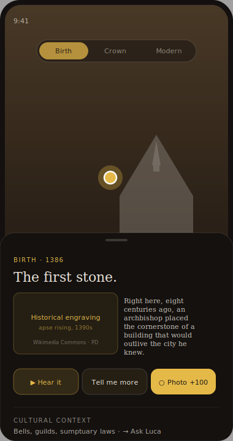

## Audio + video moments specifically

These four hotspots have **richer media** — they're the AR Experience's set pieces:

1. **1774 · Madonnina rises** — looped audio of the high bell + Luca's voice. No video.
2. **1943 · The bombs** — **20 s archival film clip** + a 3 s air-raid siren intro + before/after mini-slider of the Cariatidi.
3. **1945 · Liberation** — **20 s archival film clip** + original crowd sound.
4. **1953 · Guernica arrives** — still photo + 30 s recorded interview snippet *(stretch goal — could be a Luca-narrated dramatisation)*.

## Centering, recentering, and getting lost

If the user looks straight up at the sky or down at the floor for more than 3 seconds, the centering arrow flashes once and a "↑ Look around the square for hotspots" hint fades in at the bottom. Disappears as soon as the camera frames a known direction.

---

# TREASURE HUNT — woven through both acts

The treasure hunt **is not a separate route**. It's a tracker that lights up as the user reaches certain points. Questions and photo challenges appear contextually.

## Question challenges (text or voice)

| Trigger | Question | Accepted answer | Points |
|---|---|---|---|
| End of Chapter 1 (Birth) | *"In what year did construction of the Duomo begin?"* | 1386 | 80 |
| Crown · after match-the-architect game | *"Which architect designed both Palazzo Reale and La Scala?"* | Giuseppe Piermarini | 80 |
| End of Chapter 2 (Crown) | *"How high above the ground does the Madonnina stand?"* | 108.5 m (accepts 108) | 100 |
| End of Chapter 3 (Modern) | *"Who fell from the scaffolding of his own arcade in 1877?"* | Mengoni | 80 |
| AR hotspot 1943 · The bombs | *"What room of Palazzo Reale was destroyed and never fully restored?"* | Sala delle Cariatidi | 100 |

## Photo challenges (uses the existing capture flow)

The photo-capture flow already exists in `TreasureHunt.tsx` — the vision-model verifier is already scaffolded. Reuse it from the AR hotspot bottom sheets.

| Trigger | Prompt | Verifier subject | Points |
|---|---|---|---|
| AR · 1774 Madonnina hotspot | *"Point your camera up at the central spire and capture La Madonnina."* | "Gilded statue of the Virgin Mary on top of a Gothic spire" | 100 |
| AR · Galleria interior hotspot | *"Find the bull mosaic in the Galleria floor and photograph it."* | "Floor mosaic of a bull with crossed flag at centre of a Galleria floor" | 120 |
| AR · 1943 Cariatidi hotspot | *"Find the entrance to the Sala delle Cariatidi inside Palazzo Reale."* | "Doorway sign reading 'Sala delle Cariatidi' or a view of damaged neoclassical columns" | 100 |

## Audio/video clue challenges

Two challenges have **non-visual evidence** as part of the hunt:

- **Audio clue at 1574 saffron risotto hotspot** *(near the Duomo's north door)* — plays a 5 s audio of a glass-painter at work. Question: *"What did a Belgian glass-painter accidentally invent at this cathedral in 1574?"* Answer: *"Risotto alla milanese."* (Light, fun, food-history.)
- **Video clue at 1945 Liberation hotspot** — plays the 20 s Liberation footage. Question: *"What date is being celebrated in this footage?"* Answer: *"25 April 1945."*

## The Hunt tab

Bottom-nav "Hunt" tab is a progress tracker. Lists all challenges, marks completed ones, shows total points and a percentage. No standalone challenge UI lives here — completions happen in-context during Acts One and Two.

---

# ENDING · Souvenir face-filter photo

When the user has finished the Tour (3 chapters) **and** at least 2 AR hotspots **and** at least 3 treasure-hunt completions, the Summary screen appears with a single big CTA:

> **"Take your Milan souvenir."**

Tapping it opens the front-facing camera with real-time face detection (using `face-api.js`, a lightweight 1 MB model — no server required). Four filter options to pick:

1. **The Madonnina** — a small animated gold halo above the head, gentle gilded glow around the face.
2. **Saint of the Spires** — Gothic pinnacle silhouettes frame the face on both sides.
3. **Renaissance portrait** — sepia + soft vignette + a small Visconti-style cap.
4. **1880s flâneur** — top hat, monocle, vintage filter, "Galleria 1880" caption.

The user takes the photo. The result is shown full-screen with their score and badges overlaid in a polaroid frame. **Buttons:** *Save to phone* · *Share* · *Take another*.

This is the moment users will Instagram. Free marketing for the project.

---

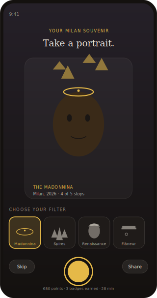

# Always-available global UI

These elements exist on every screen except where explicitly hidden:

| Element | Position | Behaviour |
|---|---|---|
| **Theme toggle** | Top-right corner (hidden in AR full-bleed) | Light/dark flip, persisted to localStorage |
| **Play/Pause pill** | Bottom-right corner | Only visible when Luca is speaking. Shows current state. **Auto-resets to stop on every route change** — global hook in AppShell calls `stopSpeaking()` on `pathname` change. |
| **"Ask Luca" chip** | Inline below scene bodies and hotspot sheets | One tap opens the chat view with a contextual pre-filled question. Returning preserves scroll position. |
| **Centering arrow** | Bottom-centre in AR only | Subtle hint toward the nearest hotspot. |
| **Bottom nav** | Bottom, four tabs | Home · AR · Guide · Hunt (the Quiz Feedback route folds into Hunt). |

# Voice character — Luca

A warm, slightly theatrical heritage guide. Settings in `chatService.ts`:

- **Voice:** prefer `Alice (Italian)` for Italian lines, `Karen` or `Alice` for English. Fallback to default.
- **Rate:** 0.95× (slightly slower than default).
- **Pitch:** 1.05× (slightly higher, warmer).
- **Pauses:** insert *commas* in narration scripts to create natural breath beats.
- **Tone words:** allow Luca occasional small interjections — "wonderful", "remarkable", "imagine that" — to feel less robotic.

When the user finishes a scene, Luca's voice fades out over 300 ms rather than cutting off.

---

# What we deliberately do NOT include

- Full Italian translation of every screen (titles + key buttons only).
- A backend or user accounts. Everything is `localStorage` + static JSON.
- Native WebXR / ARKit. Camera + `getUserMedia` is enough for the demo.
- Any treasure-hunt challenges beyond the eight listed above.
- A separate map view — the AR is the spatial interface.

---

# Open questions for the team

1. Do we have rights to a 20 s archival clip of 1945 Liberation footage? Istituto Luce archive has these; check licensing before committing.
2. Do we want all four face filters or just two for v1? (Madonnina + Renaissance portrait are most demo-friendly.)
3. Italian voice — do we have a native Italian speaker on the team for the few Italian narration lines (Luca's "Ciao", "buongiorno", etc.)?
4. Do we want the 1969 Piazza Fontana hotspot, given its political weight? Could be cut if it feels heavy for a tourist app.

---

*Document for HeritEdge · Polimi MITA · Piazza del Duomo · Delivery 26 May 2026.*

*Read, discuss, correct. Once we agree on this spec, tasks get assigned in the next document.*

---

# ADDENDUM — Italian daily life + Remote mode

Two additions to the spec, both important.

## 1. Italian daily life in each period — the cultural layer

Buildings without people are postcards. To make the tour feel personal and cultural, each chapter gets **one dedicated cultural scene** plus cultural notes woven into existing scenes. This is content the user will remember more than dates.

### Birth (1386 – 1500s) — How Milanese lived
- **Bells paced the day.** No clocks; matins woke the city before dawn, the *ora di mercato* opened the markets, the cathedral's evening bell sent labourers home. The Duomo's bells were Milan's clock.
- **Guilds organised everything.** Wool-workers, silk-weavers, goldsmiths, tanners, bakers, armourers. Each had its own patron saint, processional banner, and seat near **Piazza dei Mercanti** — which is the site the Galleria sits on today.
- **Sumptuary laws.** Furs, silk, the colour scarlet were reserved for nobility. A merchant's wife who wore the wrong cloth could be fined.
- **Plague was constant company.** The Black Death of 1348 killed roughly one in three Milanese. Outbreaks kept coming. The cult of plague-saints (Sebastian, Roch) was bound up with cathedral devotion.
- **The Fabbrica del Duomo employed hundreds.** Masons, sculptors, glassmakers, unskilled labourers. The wage lists from the 1400s still survive — among the most detailed medieval labour records in Italy.

#### New scene · **Scene 1.7 — Cultural beat · "A day in 1450"** *(35 s)*
- **Visual:** A small illuminated-manuscript-style illustration (or a Tacuinum Sanitatis page) with three time-of-day markers around it.
- **Body:** "Imagine being a stonemason on the Fabbrica payroll in 1450. You woke before dawn to the matins bell. Bought your bread at Piazza dei Mercanti — the medieval market that stood where the Galleria now stands. You worked twelve hours under the rising apse, paid in *soldi imperiali*. By the cathedral's vesper bell you were home, eating polenta with onions. Plague was a season away, like winter."
- **Audio:** Soft monastic chant under Luca's narration. A single bell at "matins", another at "vesper" — Luca's voice and the bells are timed.
- **Action:** Tap → next.


### Crown (1500s – 1860) — How Milanese lived
- **Coffee changed conversation.** The first cafés opened in the late 1600s. By the 1760s, the Caffè Demetrio gave its name to *Il Caffè* — the Enlightenment journal edited by Pietro and Alessandro Verri.
- **Risotto alla milanese is born here.** Legend says a Belgian glass-painter named **Maestro Valerio di Fiandra**, working on the Duomo's stained glass, used powdered saffron to colour his glass. At his daughter's 1574 wedding he told the cook to add it to the rice. The most-repeated origin story in Milanese food culture happened *inside the Duomo workshop*.
- **Salons became Milan's politics.** The **Salotto Maffei**, hosted by Clara Maffei from 1834, was where Verdi, Manzoni, and Risorgimento conspirators met under cover of "tea". The Italian unification was planned in living rooms.
- **Private theatre boxes were apartments.** La Scala opened in 1778 and families *owned* their boxes — they decorated them, inherited them, entertained guests during performances. The music was sometimes incidental.
- **Sedan chairs and swords.** Gentlemen carried short swords as everyday dress until the late 1600s. The wealthy moved through the city in *portantine* carried by hired bearers, before carriages.

#### New scene · **Scene 2.7 — Cultural beat · "The saffron wedding"** *(40 s)*
- **Visual:** A small period etching of a 17th-century Milanese wedding feast + a small saffron-yellow risotto plate icon.
- **Body:** "1574. Inside the Duomo workshop, a Belgian glass-painter named Maestro Valerio is finishing a window. He's been using powdered saffron to colour the glass. At his daughter's wedding, he tells the cook to add a pinch to the rice — for luck, for colour. The Milanese have been eating it that way ever since. The most famous dish of this city was probably invented, by accident, inside the building you've been hearing about."
- **Audio:** Soft baroque harpsichord under Luca's voice.
- **Action:** Tap → next.

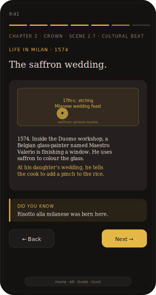

### Modern (1860 – today) — How Milanese lived
- **Aperitivo was born in the Galleria.** Bar Campari opened at the Galleria's Duomo end in 1867. Gaspare Campari served a bitter red drink before dinner; *aperitivo* (from Latin *aperire*, "to open the stomach") became a Milanese ritual.
- **The economic miracle reshaped everything.** Migration from southern Italy, the Vespa (1946), TV (RAI from 1954), eight-hour days, paid holidays, women in the workforce — Milan in twenty years (1958–78) changed more than in the previous two centuries.
- **Sunday closures were universal** until 2012. The whole city stopped on Sundays. Aperitivo and the Sunday family lunch were the day's only structure.
- **The Sabato fascista** (1922–1943) — Saturday afternoons of paramilitary exercises and Black Shirt assemblies. Replaced after Liberation by the **Festa della Liberazione** (25 April), still a national holiday.
- **Smoking indoors was normal until 2005**. The 2005 national ban changed cafés overnight. Hard to imagine now.
- **Fashion week + Salone del Mobile** turn the city into a global stage four times a year. The Milanese disappear from the centre during those weeks; visitors flood in.
- **Pride parades end in Piazza del Duomo** since 1994 — a Pope's square holding a queer celebration. Few cities tolerate that contrast as easily.

#### New scene · **Scene 3.7 — Cultural beat · "A 1960s aperitivo"** *(40 s)*
- **Visual:** A small period photograph of Bar Campari interior, c. 1960. Liberty-style fittings, suited men, women in tailored dresses.
- **Body:** "1960. The economic miracle is at its peak. You finish work at a small office near La Scala. You walk into Bar Campari with a colleague, ask for a *Negroni sbagliato*, stand at the bar — never sit. You discuss the Pirelli Tower, just finished, taller than the Madonnina. The bartender places a small replica of her on the table and says: *La signora resta la più alta. Sempre.* The lady stays the tallest. Always."
- **Audio:** Soft 1960s café chatter ambient, light Italian dialogue murmuring underneath, the clink of glasses.
- **Action:** Tap → next.

These three cultural scenes change each chapter from "6 scenes" to "7 scenes" — total tour length goes from 9 minutes to about 11 minutes. Still well within tourist attention.

---

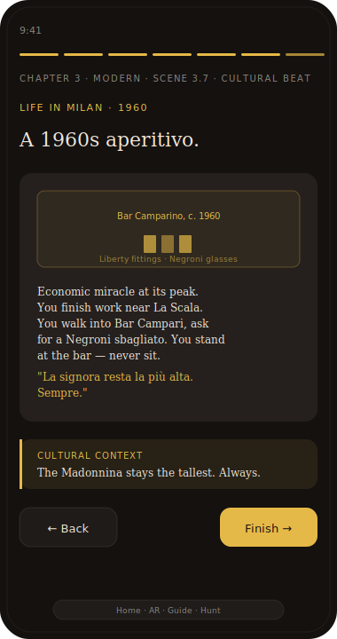

## 2. Cultural hotspots in AR — what people did, not just what happened

The existing AR hotspots are events (1386 first stone, 1898 massacre, 1943 bombs). Add a parallel layer of **cultural-life hotspots** — things people *did regularly* — so the AR captures both punctual moments and everyday rhythms.

### Birth period cultural hotspots
- **Piazza dei Mercanti** *(facing the Galleria's site)* — *"This is where Milan bought its bread for 600 years. Every morning a crier read the city's bread price aloud from the steps. The Galleria stands on top of the market that fed medieval Milan."*
- **Bell-paced labour** *(over the Duomo's bell tower)* — *"The cathedral's bell was Milan's clock. Eight strikes meant the markets opened. Twelve meant the workers ate. Six in the evening meant home."*
- **The Fabbrica payrolls** *(over the south flank of the Duomo)* — *"Hundreds of masons worked here daily. Their wages survive — in soldi imperiali — in the Fabbrica's archives, week by week, from 1387."*

### Crown period cultural hotspots
- **Risotto's accidental birthday** *(near the Duomo's north door)* — *"In 1574, a glass-painter's saffron found its way into rice at his daughter's wedding. Milan's most famous dish was invented inside this building."* (Already in spec as audio clue.)
- **Salotto Maffei's secret politics** *(toward Via Montenapoleone)* — *"Two streets from here, Clara Maffei held the salon where Verdi and Manzoni planned Italian unification over tea. The Risorgimento was conspired in living rooms."*
- **Caffè Demetrio's Enlightenment** *(toward Via Manzoni)* — *"The Verri brothers ran their journal* Il Caffè *from a café near here, between 1764 and 1766. Sixty issues. The Italian Enlightenment, in espresso form."*
- **The carriage promenade** *(over the Bastioni line)* — *"Every evening at sundown, the wealthy of Milan drove their carriages along the old walls. To see and be seen. The route was a kilometre long; an entire society compressed into a parade."*

### Modern period cultural hotspots
- **Bar Campari · aperitivo is born** *(over the Galleria's Duomo-side entrance)* — *"1867. A drink called Campari was first served standing at this bar. The ritual it created — bitter red drink before dinner — spread to the rest of Italy and never left."*
- **The 1960s economic miracle** *(over the Pirelli Tower direction)* — *"From here you can almost see the Pirelli Tower. When it opened in 1960, taller than the Madonnina, the city demanded a small Madonnina on its roof. There is one there today."*
- **Salone del Mobile** *(over the modern Galleria entrance)* — *"Once a year, the city becomes a design fair. Designers walk through this square as if they own it. They almost do."*
- **Pride 1994** *(over the central piazza)* — *"In 1994, this square held its first Pride parade. A Pope's cathedral, a public queer celebration. The contrast still defines what kind of city Milan wants to be."*

These complement the event hotspots rather than replace them. Total AR hotspots per period: ~6–8 (mix of events and culture).

---

## 3. Remote mode — AR that works from anywhere

**The AR experience must work when the user is not in Piazza del Duomo.** Reviewers will test the app from their laptops in their flats. The MITA committee will probably grade it without leaving Politecnico.

### Detection — am I at the piazza?

On entry to Act Two, the app checks (in order):

1. **Geolocation match** — if `navigator.geolocation` returns coordinates within ~200 m of Piazza del Duomo (lat 45.4642, lng 9.1900), assume **on-site**.
2. **User preference** — if the user has previously chosen "Remote mode" in settings, honour it.
3. **Camera permission denial** — if the user denies camera access, fall back to remote mode.
4. **Default** — assume **remote mode**. Show a small chip: *"You're not in the piazza — exploring from afar. Switch to live →"* — one tap reveals the camera path if they want it.

### Remote-mode AR — what it actually is

A **fixed 360° panorama** of Piazza del Duomo, captured from one point in front of the cathedral, served as a single equirectangular JPEG (~3 MB) and rendered with **Three.js + a sphere mesh**. The user swipes to rotate, pinches to zoom. Same gold hotspots float over the panorama at the right compass headings.

- All hotspot interactions work identically — tap to open the bottom sheet, view the story, listen, ask Luca.
- The period selector still tints the panorama (parchment for Birth, golden-hour for Crown, clean for Modern).
- The centering arrow becomes a **"jump to next hotspot"** button instead of a physical-orientation hint.
- The "Take a photo here →" treasure-hunt photo challenge falls back to: *"Save this view as a postcard"* — a smaller, lower-stakes challenge that still uses the existing photo-capture flow.

### Two routes diverge cleanly

| | **On-site** | **Remote** |
|---|---|---|
| Background | Live camera feed | Static 360° panorama JPEG |
| Orientation | Device gyro/compass | Swipe to look around |
| Centering arrow | Points to physical direction | Jumps to next hotspot |
| Photo challenges | Verify real photo via vision model | "Save postcard" — frames the panorama view, no verification |
| Period tint | Camera overlay filter | Panorama background tint |

### One asset to acquire

A single high-quality **360° equirectangular photo** of Piazza del Duomo. Two options:
1. Capture one ourselves on the on-location filming day (Saturday 24 May), using **Insta360** if anyone has one, or stitched panorama from an iPhone.
2. Use a public-domain panorama from **Wikimedia Commons** or **Google Street View static** (check API terms).

Recommend option 1 + option 2 as backup.

### Why this matters

- The whole team can test and iterate without commuting.
- Reviewers grade remotely without losing fidelity.
- Tourists abroad who plan to visit can preview the tour.
- Mobile-data-light visitors at the piazza can also use remote mode to save bandwidth.

The codebase already has `PanoramaScene.tsx` — extend it rather than building from scratch.

---

## Summary — what this addendum changes

- **+ 3 new "Cultural beat" scenes** (one per chapter), pushing tour length from 9 to 11 minutes.
- **+ 11 cultural hotspots in AR**, complementing the existing event hotspots.
- **+ Remote mode** for AR, gated by geolocation/permission/user choice.
- **+ 1 new asset to capture or source**: a 360° panorama of Piazza del Duomo.

These additions don't increase the implementation tasks dramatically — each cultural scene reuses the existing scene types, each cultural hotspot reuses the existing hotspot bottom sheet, and the remote-mode panorama reuses `PanoramaScene.tsx`.

---

*Addendum for HeritEdge · Polimi MITA · Piazza del Duomo project · 14 May 2026.*

---

# ADDENDUM 2 — Multi-photo time slider (replaces simple before/after)

The before/after slider concept upgrades to a **timeline slider** that supports **2 to 6 photos** of the same view across different years. The user drags through time, not just between two states.

## How it works

- **Visual:** a horizontal slider track at the bottom of the image with N notches, one per photo. Each notch shows the year label (e.g. *1744 · 1790 · 1900 · 1945 · Today*).
- **Drag handle** moves left/right along the track. The image cross-fades between the two photos adjacent to the handle's position, weighted by how close the handle sits to each.
- **Snap behaviour:** if the user releases the handle within ~10 % of a notch, it snaps to that year and the image fully resolves to that photo. Releasing between two notches keeps a blended view (educational — shows that history isn't binary).
- **Tap a notch** to jump directly to that year.
- **Caption** below the image updates with the current year and a one-sentence note for that moment (*"1744 — Bellotto paints the piazza still crowded with medieval shops."*).
- **First-time hint:** auto-plays through all the notches once, end-to-end, at 0.5 s per step, then returns to the starting year. Teaches the affordance without explanation.

## The five strongest multi-photo timelines

These are the ones I'd build, drawn from the image-sourcing dossier:

1. **Piazza del Duomo across 280 years** *(5 photos)* — `1744` Bellotto · `1840` Migliara · `1880` albumen photo · `1945` Liberation photo · `Today`. Shows the slow clearing of the medieval shops, the Galleria appearing, the bombs nearly missing, the modern square.

2. **Sala delle Cariatidi — three states** *(3 photos)* — `1900` Brogi intact · `1944` immediately after bombing · `Today` deliberately scarred. The original before/after extended with the wartime photograph in the middle. The most powerful sequence in the app.

3. **The Duomo façade · four phases** *(4 photos)* — `1521` Cesariano elevation drawing · `1790` engraving showing the unfinished brick face · `1813` Napoleon-completed façade · `Today` cleaned and restored.

4. **The Madonnina · three views** *(3 photos)* — `1774` engraving of her being raised · `1880` albumen photo of her in place · `Today` hi-res close-up. Same statue, three eras of viewing technology.

5. **The Galleria's site · three eras** *(3 photos)* — pre-1860 engraving of the medieval Santa Tecla streets · 1870s construction-era photograph with the iron skeleton · today's interior under the dome. Shows the bulldozing.

## Scene type spec

Replace the planned `beforeAfter` scene with:

```jsonc
{
  "kind": "timelineSlider",
  "id": "piazza-280-years",
  "frames": [
    {
      "year": "1744",
      "yearShort": "1744",
      "image": "/history/piazza/bellotto-1744.jpg",
      "caption": "Bellotto paints the piazza still crowded with medieval shops."
    },
    {
      "year": "1840",
      "image": "/history/piazza/migliara-1840.jpg",
      "caption": "Romantic-era painters arrive. The shops are still there."
    },
    {
      "year": "1880",
      "image": "/history/piazza/albumen-1880.jpg",
      "caption": "The first photographs. The clearing has begun."
    },
    {
      "year": "1945",
      "image": "/history/piazza/liberation-1945.jpg",
      "caption": "Liberation Day. The square fills with the first free crowd in years."
    },
    {
      "year": "Today",
      "image": "/history/piazza/today.jpg",
      "caption": "Pedestrian. Cleared. Six million visitors a year."
    }
  ]
}
```

The component renders the timeline track, the photos, and the captioned cross-fade. **One shared component** — `TimelineSlider.tsx` — drives all five timelines above plus any future ones, including from inside AR hotspot bottom sheets.

## Where these appear

- **Inside the Quick Guide:** each chapter closes on one timeline slider relevant to that period. Chapter 1 closes on *Piazza del Duomo across 280 years* (foundations to today). Chapter 2 closes on *Façade · four phases*. Chapter 3 closes on *Sala delle Cariatidi — three states*.
- **Inside AR hotspot bottom sheets:** when a hotspot has more than two relevant photos (Madonnina, the Galleria's site), the same `TimelineSlider` slots in instead of a single image.
- **The treasure-hunt success panel:** when a photo challenge is verified correct, show the reveal as a 2-frame slider of *"What you photographed → what it looked like in [historical year]"*. A small reward, a moment of "ah".

## Why this is better than simple before/after

The two-state slider says "things changed". The multi-photo slider says **"things change continuously — you can see the steps"**. For a six-century cathedral, that's the right metaphor. It also lets us use *all* the historical images we sourced, not just two of them per place.

---

*Addendum 2 for HeritEdge · 14 May 2026.*
