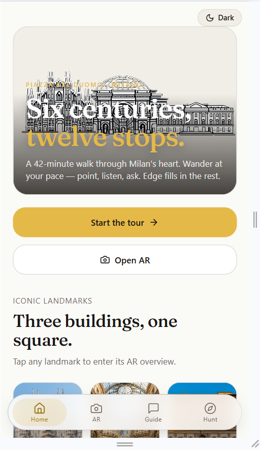
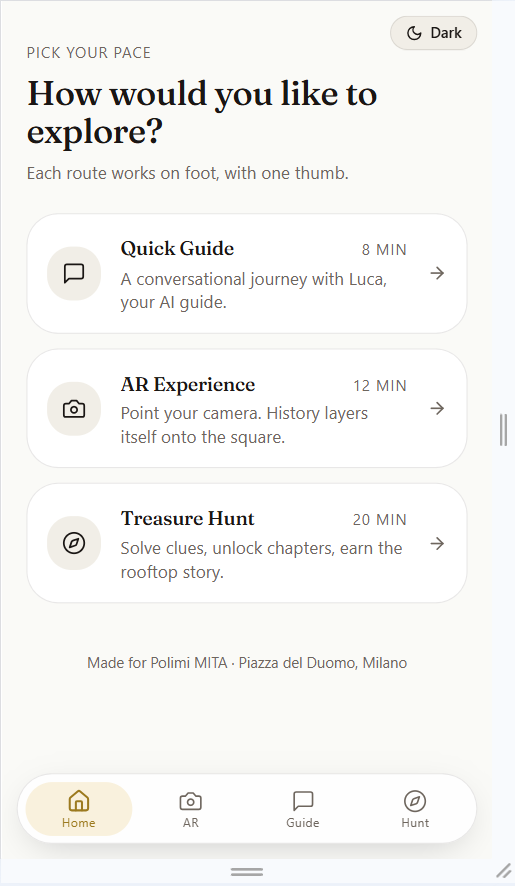
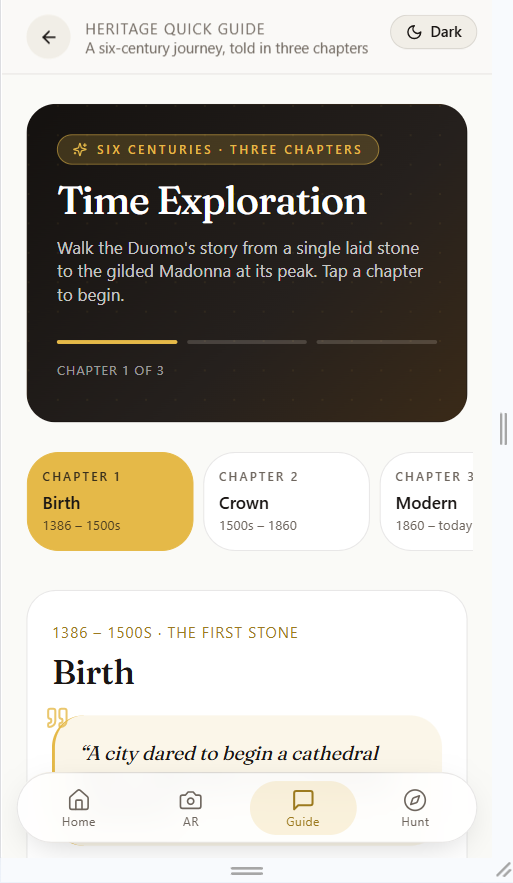
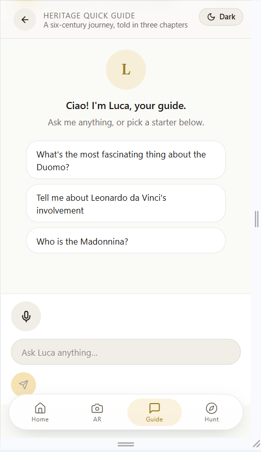
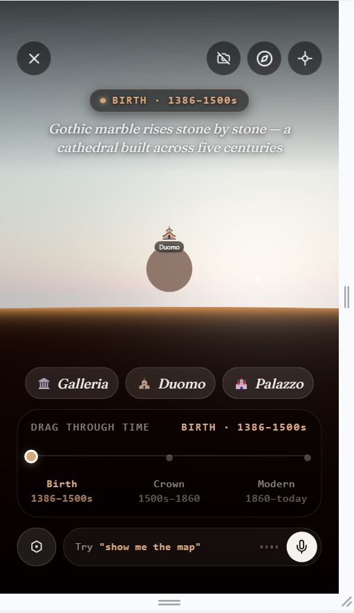
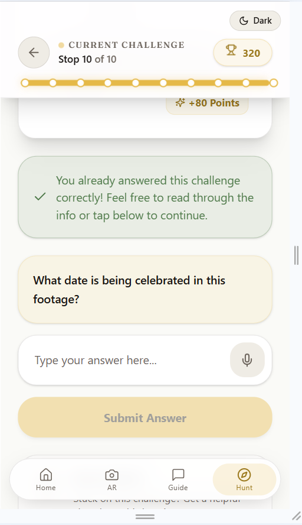
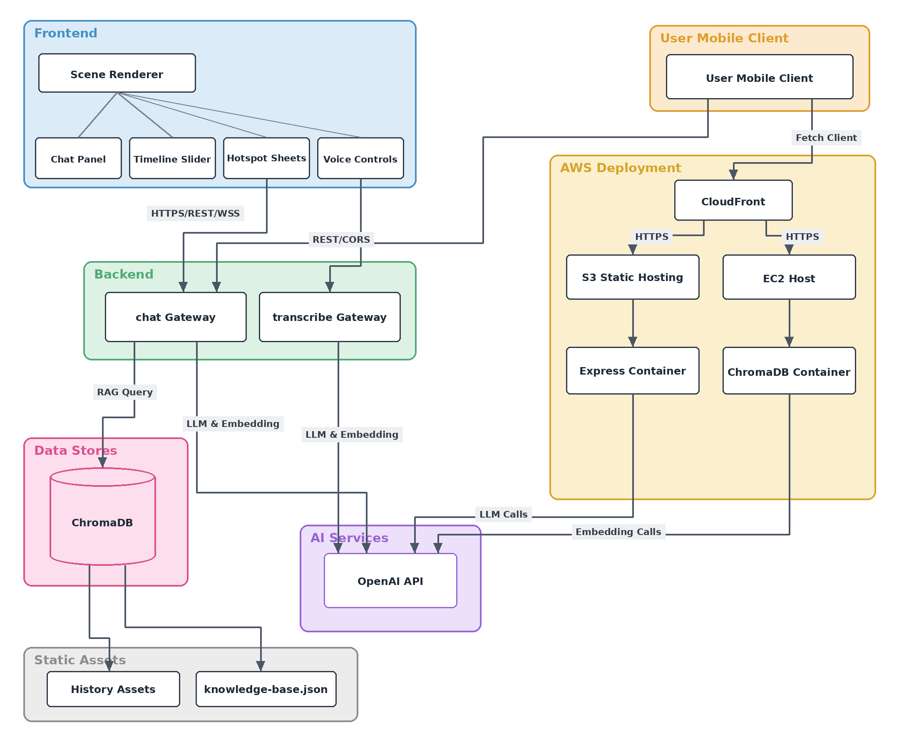

# HeritEdge

**A multimodal web experience for the cultural heritage of Piazza del Duomo, Milan.**

HeritEdge turns a visit to Milan's Piazza del Duomo into an interactive journey through six centuries of the square's history. It combines a conversational AI guide, a camera-based AR experience, and a treasure hunt, exploring the Duomo, the Galleria Vittorio Emanuele II, and Palazzo Reale across time.

Built for the *Multimedia Interactive Technologies and Applications* (MITA) course at Politecnico di Milano, A.Y. 2025/2026.

---

## Screenshots

A guided walk through the experience, from arrival to the final challenge:

| | | |
|:--:|:--:|:--:|
|  |  |  |
| **Home** <br/> *Six centuries, twelve stops* | **Pick a route** <br/> *Quick Guide · AR · Hunt* | **Time Exploration** <br/> *Birth · Crown · Modern* |
|  |  |  |
| **Conversational Guide** <br/> *Ask Luca by voice or text* | **AR Experience** <br/> *Drag through time, steer by voice* | **Treasure Hunt** <br/> *Ten stops, mic-or-tap answers* |

---

## Features

HeritEdge offers three complementary tasks plus a shared *Time Exploration* story view:

- **Quick Guide** — *Time Exploration* tells the story of Piazza del Duomo in three chapters — **Birth** (1386–1500s), **Crown** (1500s–1860) and **Modern** (1860–today) — then hands you over to **Luca**, the AI guide, who answers follow-up questions by voice or text. Each answer is grounded in a curated knowledge base and links to its sources.
- **AR Experience** — a panoramic view of the piazza with hotspots for the Duomo, Galleria and Palazzo. Drag through the three eras with the timeline scrubber, tap a landmark to read its facts, or steer the scene with a spoken command like *"take me to the Duomo at birth."*
- **Treasure Hunt** — ten situated challenges across the square. Frame an artifact with the camera or answer a question with mic or keyboard; if you're stuck, a laddered hint system nudges you (location → category → near-spoiler) without giving the answer away.

The experience is multimodal throughout — voice and conversation alongside camera vision — and two of the three tasks fuse both modalities to complete.

---

## Architecture



A React single-page app talks, through Amazon CloudFront, to a Node.js / Express API and a ChromaDB vector database running on Amazon EC2; the static site is hosted on Amazon S3. Further design and interaction diagrams — modality fusion, the navigation map, the RAG pipeline and the AR flow — are in [`docs/diagrams/`](docs/diagrams/).

---

## Running locally

### Prerequisites

- **Node.js 20+** — https://nodejs.org
- **Git**
- A modern browser. For the AR experience on a phone, use **Chrome on Android**.

### 1. Get the code

```bash
git clone <repository-url>
cd HeritEdge
```

### 2. Start the backend API

```bash
cd Website/apps/api
cp .env.example .env      # Windows: copy .env.example .env
npm install
npm run dev
```

The API listens on `http://localhost:3001`. Verify it with `curl http://localhost:3001/health` — it should return `{"ok":true}`.

Open the `.env` you just created and add your keys (see `.env.example`): a GitHub Models token or an OpenAI API key powers the AI features. The UI still runs without keys — the AI endpoints return stub responses.

### 3. Start the web app

In a second terminal:

```bash
cd Website
npm install
npm run dev
```

Open the URL Vite prints — usually `http://localhost:5173`. The web app calls the API at `localhost:3001` by default.

### 4. (Optional) Test AR on a phone

The AR experience needs HTTPS for camera and motion-sensor access. Expose the dev server through an HTTPS tunnel:

```bash
npm run dev -- --host     # in the Website folder
ngrok http 5173           # in a second terminal
```

Open the `https://....ngrok-free.app` URL in Chrome on an Android phone. Cloudflare's `cloudflared tunnel --url http://localhost:5173` works the same way.

---

## Project structure

```
HeritEdge/
├── Website/
│   ├── src/            # React app — tour, AR, hunt, chat, content
│   ├── apps/api/       # Node.js + Express backend API
│   └── ...
├── Conceptual_Design/  # storyboards, specs, mockups
└── docs/               # diagrams and screenshots
```

---

## Heritage content sources

The historical facts in the app (`Website/src/content/knowledge-base.json`) are drawn from official and archival sources:

- **Duomo** — Veneranda Fabbrica del Duomo (official): https://www.duomomilano.it
- **Galleria and city history** — Comune di Milano: https://www.comune.milano.it
- **Palazzo Reale** — Palazzo Reale Milano (official): https://www.palazzorealemilano.it
- **Wartime history** — Archivio Storico Civico di Milano

Historical images are sourced from open-access repositories — Wikimedia Commons, Pinacoteca di Brera, Veneranda Biblioteca Ambrosiana, Lombardia Beni Culturali and Google Arts & Culture — used under public-domain or Creative Commons licences. Per-image attributions are in [`Website/ATTRIBUTIONS.md`](Website/ATTRIBUTIONS.md).

---

## Team

Elisha Anankansa · Shashi Bhushan · Viplove Gadkari · Miguel Gutierrez · Cristhian Mejia · Mohammed Umayr

Politecnico di Milano — MITA, A.Y. 2025/2026.

---

## Credits

UI components from [shadcn/ui](https://ui.shadcn.com/) (MIT licence). Reference photography from [Unsplash](https://unsplash.com). Full attributions in [`Website/ATTRIBUTIONS.md`](Website/ATTRIBUTIONS.md).
