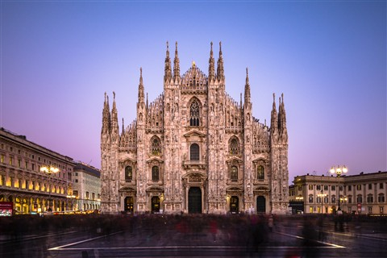
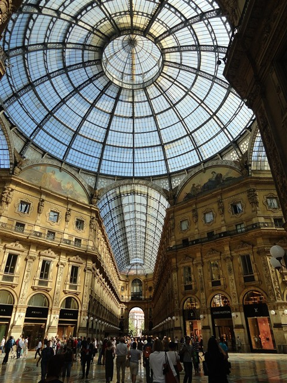
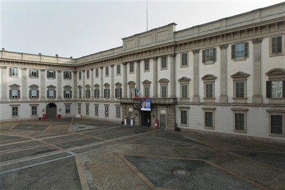

# Treasure Hunt — Experience Design

**Status:** draft for team alignment · **Owners:** A (logic + backend), B (UI + content) · **Depends on:** Task 5 (real reference photos — placeholders below)

This doc describes the **end-to-end hunt experience** so teammates can build the matching code without re-reading the JSON or the existing component. It covers:

1. The user journey (one full hunt, start → finish)
2. Each challenge: the question we ask, the expected answer, the source fact, and a reference image
3. The two challenge types (Question, Photo) and how they're graded
4. LLM hints (when the user is stuck)
5. Photo verification with retry + low-confidence fallback
6. Per-step recap

All facts come from [`knowledge-base.json`](../src/content/knowledge-base.json). All challenges live in [`treasure-hunt.json`](../src/content/treasure-hunt.json) (photos already there; question entries proposed below).

---

## 1. The hunt at a glance

The visitor walks **Piazza del Duomo** in physical order. A hunt is a sequence of 5 challenges across the three landmarks, alternating types so the visitor isn't doing 5 photos in a row.

```
START
  │
  ▼
┌──────────────────────────────────────────────────────────┐
│  CH1 · Duomo / La Madonnina        (PHOTO)               │
│  CH2 · Duomo / Construction year   (QUESTION — voice/text)│
│  CH3 · Galleria / Bull mosaic      (PHOTO)               │
│  CH4 · Galleria / Mengoni          (QUESTION — voice/text)│
│  CH5 · Palazzo Reale / Cariatidi   (PHOTO)               │
└──────────────────────────────────────────────────────────┘
  │
  ▼
SUMMARY (existing /summary route)
```

Each step has the same micro-loop:

```
prompt → attempt → verify → recap → next
            ▲          │
            │          ▼ (low conf / wrong)
         hint ◀──── stuck?
```

---

## 2. Challenge catalog

> 🟦 **Reference image** = wide marker shot (the AR-trackable scene the user is standing in front of). Master copies live in [`/public/markers/`](../public/markers/); local previews of the same files live in [`./images/`](./images/) next to this doc. Will be swapped for Viplove's real reference photos when Task 5 lands.
> 🟩 **Expected user photo / scene** = the close-up subject the visitor is actually meant to capture (for PHOTO challenges) or the visual context they're standing in (for QUESTION challenges). Used here as a stand-in for what the vision model will compare against.
>
> *If you don't see the images:* you're probably viewing the raw `.md` source instead of the rendered preview. In VSCode press `Ctrl+Shift+V` to open the preview pane.

---

### CH1 · La Madonnina (PHOTO)

| Field | Value |
|---|---|
| **Landmark** | Duomo |
| **Type** | photo |
| **Prompt to user** | *"Take a photo of La Madonnina — the golden statue on top of the Duomo's tallest spire. Point your camera upward at the central spire."* |
| **What we accept** | Image where the upper central facade / tallest spire is clearly framed and the gold figure is visible (even small). |
| **Subject keywords for vision LLM** | `golden statue`, `Madonna`, `Madonnina`, `top of spire`, `Duomo central facade` |
| **Source fact** | `duomo-madonnina-1774` |
| **Recap on success** | "Well done! La Madonnina stands 108.5 m above Piazza Duomo. Placed in 1774, she is gilded copper and stands 4.16 m tall. A Milanese tradition says no building in Milan may exceed her height — a rule respected until 1958." |
| **Recap on miss** | "The statue is called La Madonnina (the little Madonna). Try again — stand in the piazza and look up at the tallest central spire." |
| **Reference image (wide)** |  |
| **Expected user photo (close-up)** |  *(placeholder — swap when Task 5 delivers a true close-up of La Madonnina)* |

---

### CH2 · When did construction begin? (QUESTION — voice or text)

| Field | Value |
|---|---|
| **Landmark** | Duomo |
| **Type** | question (free-form, voice or text) |
| **Prompt to user** | *"You are standing in front of the Duomo. In what year did construction begin?"* |
| **Expected answer** | `1386` |
| **Accepted variants** | "1386", "thirteen eighty-six", "1386 AD", "in 1386" |
| **Source fact** | `duomo-1386-foundation` |
| **Recap on success** | "Correct — 1386, under Archbishop Antonio da Saluzzo. Construction continued for nearly six centuries, spanning Milan's evolution from medieval commune to modern metropolis." |
| **Recap on miss** | "Not quite. The first stone was laid in 1386. The building took almost 600 years to finish." |
| **Reference image (wide)** |  |
| **Scene the user is in** |  *(same marker — the user is in the piazza facing the facade while answering)* |

> 🆕 **New entry** — to be added to `treasure-hunt.json` (does not exist yet).

---

### CH3 · The Bull on the Floor (PHOTO)

| Field | Value |
|---|---|
| **Landmark** | Galleria Vittorio Emanuele II |
| **Type** | photo |
| **Prompt to user** | *"Find the mosaic bull emblem on the Galleria floor and take a photo of it. Tip: look near the centre of the octagonal crossing."* |
| **What we accept** | Photo of a circular mosaic floor panel showing a bull figure. The worn-down centre is a strong visual cue. |
| **Subject keywords for vision LLM** | `bull`, `mosaic floor`, `coat of arms`, `Galleria`, `octagonal crossing` |
| **Source fact** | `galleria-mosaic-floor` |
| **Recap on success** | "Well spotted! The bull is the emblem of Turin. Spinning on your heel three times is said to bring good luck — the mosaic is worn down from centuries of heel-spins." |
| **Recap on miss** | "The mosaic bull represents Turin, one of the four Italian cities whose crests decorate the floor. The other three are Milan, Florence, and Rome. Head to the centre of the octagonal crossing and look down." |
| **Reference image (wide)** |  |
| **Expected user photo (close-up)** |  *(placeholder — swap when Task 5 delivers a true close-up of the worn bull-mosaic centre)* |

---

### CH4 · Who designed the Galleria? (QUESTION — voice or text)

| Field | Value |
|---|---|
| **Landmark** | Galleria Vittorio Emanuele II |
| **Type** | question (free-form, voice or text) |
| **Prompt to user** | *"Who is the architect that designed the Galleria Vittorio Emanuele II?"* |
| **Expected answer** | `Giuseppe Mengoni` |
| **Accepted variants** | "Mengoni", "Giuseppe Mengoni", "Mengoni, Giuseppe" |
| **Source fact** | `galleria-mengoni-1865` |
| **Recap on success** | "Right — Giuseppe Mengoni. He designed it between 1865 and 1877; it is one of the world's oldest shopping arcades and forms the northern edge of Piazza del Duomo." |
| **Recap on miss** | "The architect was Giuseppe Mengoni. He worked on the Galleria from 1865 until its completion in 1877." |
| **Reference image (wide)** |  |
| **Scene the user is in** |  *(same marker — the user is under the iron-and-glass arcade while answering)* |

> 🆕 **New entry** — to be added to `treasure-hunt.json` (does not exist yet).

---

### CH5 · The Ballroom That Was Never Rebuilt (PHOTO)

| Field | Value |
|---|---|
| **Landmark** | Palazzo Reale |
| **Type** | photo |
| **Prompt to user** | *"Enter Palazzo Reale and find the Sala delle Cariatidi — the bombed ballroom left unrestored since 1943. Take a photo of the room."* |
| **What we accept** | Interior shot showing damaged stucco / caryatid columns / scarred walls of the unrestored hall. |
| **Subject keywords for vision LLM** | `Sala delle Cariatidi`, `caryatid`, `bombed ballroom`, `unrestored`, `damaged interior` |
| **Source fact** | `palazzo-reale-postwar-restoration` + `palazzo-reale-museum-today` |
| **Recap on success** | "Exactly! The Sala delle Cariatidi was the royal ballroom, destroyed by fire after the 1943 bombing and deliberately left unrestored as a permanent war memorial. Today Palazzo Reale is one of Italy's most visited exhibition venues." |
| **Recap on miss** | "The room is called the Sala delle Cariatidi. Ask staff at the entrance — it is one of the most striking spaces in the building." |
| **Reference image (wide)** |  |
| **Expected user photo (close-up)** |  *(placeholder — swap when Task 5 delivers a true interior shot of the Sala delle Cariatidi)* |

---

## 3. The two challenge types

### 3a. Question challenges (text **or** voice)

The user answers in free-form. **Two input paths share the same grading:**

- **Text** — type into a single-line input, press Submit.
- **Voice** — tap mic, speak, the existing `useVoiceService` hook returns a transcript, we treat the transcript as if it had been typed.

Grading flow (backend):

```
user_answer ──▶ POST /hunt-grade
                  body: { challengeId, answer }
                  ▼
              fast keyword match (case-insensitive, accent-stripped)
                  │
            ┌─────┴─────┐
        match        no match
            │             │
            │             ▼
            │       LLM judge with the source fact as context
            │       returns { correct: bool, confidence, reason }
            ▼             ▼
                  { correct, confidence, recapText }
```

Why two-stage: the keyword match is free and instant for the obvious cases ("1386"); the LLM judge handles paraphrases and partial answers ("around the late 14th century") without us hand-writing every variant.

### 3b. Photo challenges

Capture flow (UI):

```
[ Take Photo ] (uses <input capture="environment"> on mobile)
       │
       ▼
   preview thumbnail + [ Retake ] / [ Submit ]
       │
       ▼
   POST /verify-photo  (multipart: file + challengeId)
       │
       ▼
   { verdict: "match" | "low-confidence" | "no-match",
     confidence: 0..1, reason: string }
```

Verdict handling:

| verdict | UI behaviour |
|---|---|
| `match` | Recap (success), award points, **Next** |
| `low-confidence` | Soft prompt: *"We're not sure this is the right subject. Submit anyway, or retake?"* — both options are allowed (don't punish the user for bad lighting). If they submit anyway, success path with a slightly softer recap. |
| `no-match` | Recap (miss), **Retry** button. After 2 misses on the same challenge, the **Hint** button auto-expands. |

Backend uses a vision LLM (default `gpt-4o-mini`) prompted with the challenge's `subject keywords` and asked: *"Does this image show {subject}? Respond with verdict, confidence 0-1, one-sentence reason."*

---

## 4. LLM hints — "I'm stuck"

A 💡 **Hint** button is always visible while a challenge is open. Tapping it calls:

```
POST /hunt-hint
  body: { challengeId, attemptCount }
  ▼
{ hint: string }   // 1–2 sentences, never reveals the answer
```

Backend wraps the existing RAG `/chat` pipeline with a hint-shaped system prompt:

> "The user is stuck on the challenge below. Give a *nudge*, not the answer. Mention what to look at or where to stand. Maximum 2 sentences. Do not state the final answer."
> *Challenge:* `{title}` · *Subject:* `{photoPrompt | question}` · *Source fact:* `{related fact body}`

Hint-laddering by `attemptCount`:

- attempt 1 → location-only hint ("look up at the tallest spire")
- attempt 2 → category hint ("it's a religious figure, gold-coloured")
- attempt 3 → near-spoiler ("it is called *La Madon...*") — last resort

---

## 5. Per-step recap

After every challenge (success or miss), we show a recap card *before* moving to the next challenge. This is the **learning beat** — the hunt is not just a quiz, it teaches.

```
┌─────────────────────────────────────────────┐
│  ✅  Recap                                  │
│  ─────────────────────────────────────────  │
│  [reference photo, 16:10]                   │
│                                             │
│  La Madonnina stands 108.5 m above Piazza   │
│  Duomo. Placed in 1774, she is gilded       │
│  copper and 4.16 m tall…                    │
│                                             │
│  📚 Source: Comune di Milano                │
│  +100 pts                                   │
│                                             │
│  [ Next challenge → ]                       │
└─────────────────────────────────────────────┘
```

Recap text comes from the `feedback.correct` / `feedback.incorrect` fields in `treasure-hunt.json`, with a 📚 link to the underlying knowledge-base source. The final summary screen (existing `/summary` route) aggregates these into the end-of-hunt review.

---

## 6. Open decisions for the team

1. **Vision model for `/verify-photo`**: `gpt-4o-mini` (cheap, fast) or vendor-neutral via the same Azure inference endpoint we already use for `/chat`?
2. **Question grading**: keyword-first then LLM-judge (current proposal), or always-LLM?
3. **Voice input for QUESTION challenges**: reuse `useVoiceService` as-is, or wire a slimmer push-to-talk that doesn't trigger the chatbot acknowledgement TTS?
4. **Reference photos** (Task 5): we're starting with the three placeholders in `/public/markers/`. Once Viplove delivers, we update `markerImage` paths in `treasure-hunt.json` — no UI change needed.
5. **Hint cost**: should using a hint reduce the points on that challenge (e.g. -25%)? Or keep hints free?

---

## 7. Files this experience touches

| Concern | File |
|---|---|
| Challenge content | [`src/content/treasure-hunt.json`](../src/content/treasure-hunt.json) — extend with question entries |
| Source facts | [`src/content/knowledge-base.json`](../src/content/knowledge-base.json) — already has all needed facts |
| Hunt UI / state machine | [`src/app/components/TreasureHunt.tsx`](../src/app/components/TreasureHunt.tsx) — replace hardcoded `challenges` array; add free-form input + voice + camera-capture flow |
| Frontend services | [`src/services/`](../src/services/) — add `huntService.ts` (gradeAnswer, verifyPhoto, getHint) |
| Backend routes | [`apps/api/src/routes/`](../apps/api/src/routes/) — add `verify-photo.ts`, `hunt-hint.ts`, `hunt-grade.ts` |
| API entry | [`apps/api/src/index.ts`](../apps/api/src/index.ts) — register the three new routers |
| Reference images | [`public/markers/`](../public/markers/) — placeholders, swap when Task 5 delivers |
